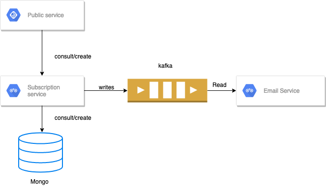

# Adidas code challenge

## Arquitecture

The project consist on 3 services:

  * Public service: service for the communication of the web users.Communicates with the subscription server for do his operations. To see the service API (http:localhost:4006)
  * Subscription service: Internal service witch acutes as a bridge between the database and email sender. When an subscription is created writes the subscription into a kafka topic.  To see the service API (http:localhost:3001)
  * Email service: reads from a kafka topic new subscriptions for sending confirmation mail to the new subscribed users.

As db i use mongodb, and kafka as a stream queue.

## RUNNING PROJECT

Each projects service it is dockerized. For running the project i set a docker-compose file. Before execute the project we must export these env variable firs (Kafka image restrictions):
`export HOST_IP=$(ifconfig | grep -E "([0-9]{1,3}\.){3}[0-9]{1,3}" | grep -v 127.0.0.1 | awk '{ print $2 }' | cut -f2 -d: | head -n1)`

After that we can set up the environment running:

`make run_environment`

and we can set down the environment running:

`make stop_environment`

The url of the public service is `http://localhost:4005`. 
The url of the subscription service is `http://localhost:4006`
Because email service is not sending real emails, instead of sending the email the system wrote a log with email information. To check that we must see the container logs
## CI/CD

For the CI/CD I used github workflow. On the file `.github/workflows/nodejs.yml` we can see the pipeline of CI. (I did not do the deployment but on a real project would mean build the docker images, upload the images to a sandbox environment, launch Integration and acceptances test, ...)
## Frameworks used

* Express js:  Express is a minimal Node.js web framework. I choose because it is mature, it is performance and also secure. I do not like overloaded framework i prefer lightweight frameworks that does one thing a does it well. 
* Jest.js: Jest js is a testing framework done by Facebook. When i can i choose jest over other testing frameworks because provides a powerful mock functionality that ables to test any part of your code easily and fast.
* Moongose: Moongose is a framework for manage interaction wiht mongodb database. I choose it because made easier to interact with mongo that the normal library provided by mongodb team.
* KafkaJs: kafka js is a library witch provides functionality to interact with kafka streams. I used because the basic uses cases that are produce and consume are easy to do using these functionality.
* Joi: Joi is validation library witch makes easy describe your data and validates them. Although mongoose has a validation layer i prefer use joi over it because it is not tied to any database system and it is more powerful on point of view.